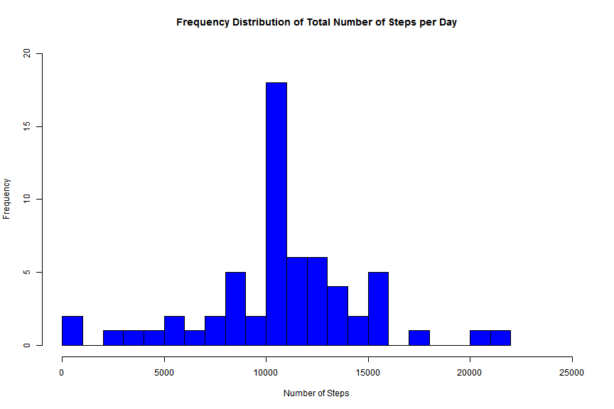
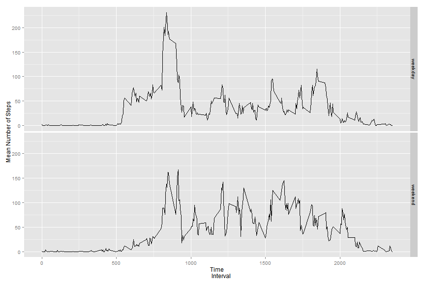

#Reproducible Research: Peer Assessment 1
******
##Defaults and Libraries
Before starting the project, we first set the global options for the markdown file.

```r
knitr::opts_chunk$set(fig.width=12, fig.height=8, fig.path='Figs/',
                      echo=TRUE, warning=FALSE, message=FALSE)
```
For packages, the packages plyr and ggplot are used.

```r
library(plyr)
library(ggplot2)
```


##Loading and Preprocessing the Data
The following code loads the data into R and reads the file:

```r
if (!file.exists("repdata-data-activity.zip")) {
  temp <- tempfile()
  download.file("http://d396qusza40orc.cloudfront.net/repdata%2Fdata%2Factivity.zip", temp)
  activity <- read.csv(unz(temp, "activity.csv"), header = T, stringsAsFactors = F)
  unlink(temp)
} else {
  activity <- read.csv(unz("repdata-data-activity.zip", "activity.csv"), 
                       header = T, stringsAsFactors = F)
}
```
##Mean Total Number of Steps Taken per Day
If the missing values (NA) are ignored, the distribution of the total number of steps is shown in the following histogram.

```r
activity_1=na.omit(activity)
sum=rowsum(activity_1$steps,activity_1$date)
hist(sum,breaks=16,xlab='Number of Steps',
     main='Frequency Distribution of Total Number of Steps per Day',
        col='blue',xlim=c(0,25000))
```

 

The histogram shows that the distribution of total steps for days with non-zero number of steps is fairly symmetrical about the mode. Moreover, the mean and median total number of steps is 1.0766189 &times; 10<sup>4</sup> and 10765 respectively.

```r
mean(sum)
```

```
## [1] 10766.19
```

```r
median(sum)
```

```
## [1] 10765
```

##Average daily Activity Pattern
We will now analyse the time series of the mean number of steps across all days.We will first use the ddply package to compute the mean number of steps per day.

```r
interval_steps=ddply(activity_1,~interval,summarise,mean=mean(steps))
head(interval_steps)
```

```
##   interval      mean
## 1        0 1.7169811
## 2        5 0.3396226
## 3       10 0.1320755
## 4       15 0.1509434
## 5       20 0.0754717
## 6       25 2.0943396
```
The time series for each 5 minute interval is plotted below:

```r
plot(interval_steps$mean~interval_steps$interval,type='l',xlab='Time interval',
     ylab='Mean number of steps', 
        main='Mean number of Steps in Each Time Interval Across All Days')
```

 
From the time series plot, the maximum number of steps occurs between 500 and 1000 time intervals. The corresponding interval and maximum value is shown below:

```r
interval_steps[interval_steps$mean==max(interval_steps$mean),]
```

```
##     interval     mean
## 104      835 206.1698
```

##Imputing Missing Values
The total number of missing values in the data is 2304.

```r
sum(is.na(activity$steps))
```

```
## [1] 2304
```

To impute the missing values, we will replace each 'NA' with the mean number of steps for that interval. Note that activity_imputed is the dataset with NA values replaced.

```r
index=c(seq(1,length(activity$steps)))
activity_2<-(cbind(index,activity))
impute.mean <- function(x) replace(x, is.na(x), mean(x, na.rm = TRUE))
activity_imputed <- ddply(activity_2, ~ interval, transform, steps = impute.mean(steps))
activity_imputed<-data.frame(activity_imputed[order(activity_imputed$index), ])
head(activity_imputed)
```

```
##     index     steps       date interval
## 1       1 1.7169811 2012-10-01        0
## 62      2 0.3396226 2012-10-01        5
## 123     3 0.1320755 2012-10-01       10
## 184     4 0.1509434 2012-10-01       15
## 245     5 0.0754717 2012-10-01       20
## 306     6 2.0943396 2012-10-01       25
```

We re-plot the histogram of the distribution of the frequency of the total number of steps:

```r
sum_imputed=rowsum(activity_imputed$steps,activity_imputed$date)
hist(sum_imputed,breaks=16,xlab='Number of Steps',
     main='Frequency Distribution of Total Number of Steps per Day',col='blue',
        xlim=c(0,25000),ylim=c(0,20))
```

 

The new mean and median is calculated as follows:

```r
mean(sum_imputed)
```

```
## [1] 10766.19
```

```r
median(sum_imputed)
```

```
## [1] 10766.19
```

From above, we see that the imputed data set has the same mean and slightly higher median. The shape of the histogram did not change much, which indicates that the imputation did not significantly affect the distribution of the data.

##Differences in Activity Patterns between Weekdays and Weekends
Using the imputed data, we first change the dates to date variable. Then we apply weekdays() to categorise the data into weekday and weekends.

```r
activity_imputed$date <- as.Date(activity_imputed$date, "%Y-%m-%d")
activity_imputed$weekday <- weekdays(activity_imputed$date)
activity_imputed$type_of_day <- as.factor(ifelse(activity_imputed$weekday %in% 
        c("Saturday", "Sunday"), "weekend", "weekday"))
summary(activity_imputed$type_of_day)
```

```
## weekday weekend 
##   12960    4608
```

We now calculate the mean number of steps of each interval for weekdays and weekends.

```r
weekday_steps=ddply(activity_imputed,.(interval,type_of_day),summarise,mean=mean(steps))
head(weekday_steps)
```

```
##   interval type_of_day       mean
## 1        0     weekday 2.25115304
## 2        0     weekend 0.21462264
## 3        5     weekday 0.44528302
## 4        5     weekend 0.04245283
## 5       10     weekday 0.17316562
## 6       10     weekend 0.01650943
```

We are now ready to plot the time series for both weekdays and weekends

```r
qplot(y=mean,x=interval, data = weekday_steps, geom ='line',facets=type_of_day~.,xlab='Time
      Interval', ylab='Mean Number of Steps')
```

 

From the plot, we see that there is an obvious spike during weekdays in the interval between 500 to 1000. This corresponds to the interval for maximum number of steps stated above. For weekends, the mean number of steps does not go above the 200 mark.

******
<center> End of Report</center>
